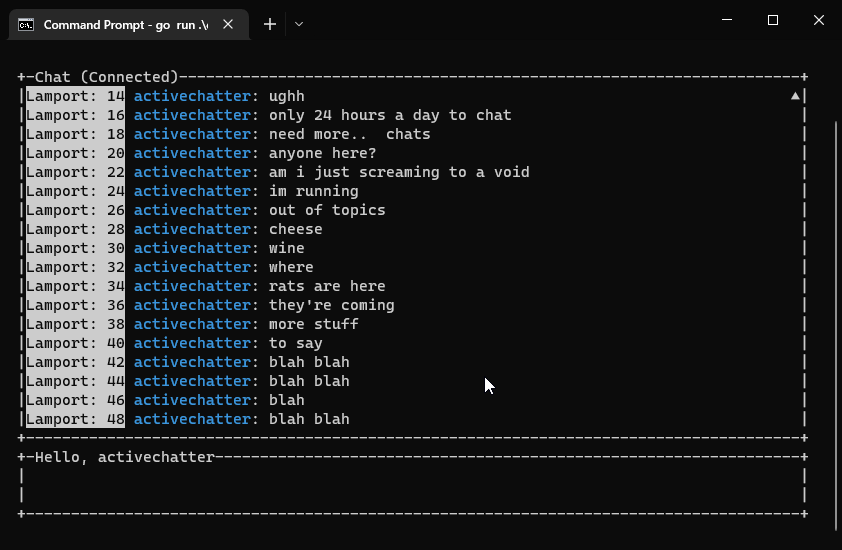
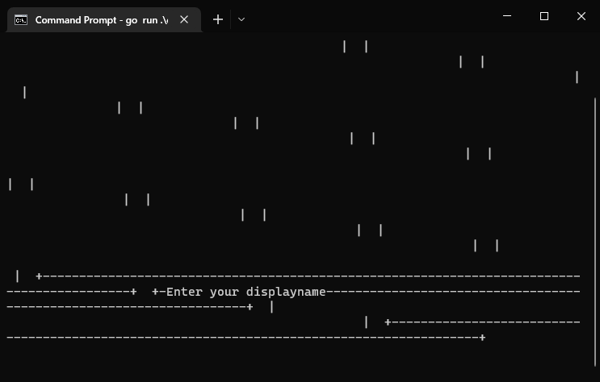

# ChittyChat
BSDISYS1KU-20222, mandatory handin 3

## Dependencies
Other than the obvious `gRPC`-dependency, we also use `github.com/gizak/termui/v3` & `golang.design/x/clipboard`.

These are respectively used for having a chat-ui (separate input and output boxes for a "prettier" look) - and for accessing the clipboard (only pasting), since termui uses polling of keyboard events rather than "text" input.

##  How to run

 1. Run `client.go` & `server.go` in separate terminals - the order does not matter, however the client only has a timeout of 5 seconds, so you might be forced to input name twice if `client.go` starts up first:

    ```console
    $ go run .\server\server.go -port *
    $ go run .\client\client.go -logname * -server *
    ```
All parameters are optional, `-logname` affects the name of the `*-log.txt` file, `-port` (and `-server`) has a default value set to 5400.

2. You will be greeted with a UI asking you to enter your displayname - this can be a max of 20 characters. This is input by making sure the terminal has focus, and then just using keyboard to type whatever you desire your display-name to be. Pressing "Enter" will then attempt to authenticate you with server, note that names are required to be unique - but only for active connections, so if a user leaves, that name gets freed up for usage.

3. Chat back and forth (if multiple clients have been opened) - if you are an active chatter thats forgotten what an original question was, you can use `Up/Down` arrowkeys, or scrollwheel, to scroll in the chat.
>
A new message appearing will automatically put you back down to the bottom of the chat - this setting cannot be disabled (unless you change the code)

4. Exiting/leaving the chat can be done by pressing `Control+C`


##  Stuff that might go wrong
>
There is a chance that upon running the client, the UI will look all scrambled. This is solved by quickly resizing the UI, after which it will stay "normal".

Colors are not uniform between every terminal - in the ones tested, PowerShell and Windows Terminal (old & new), yellow was the main culprit of weirdness. This is, like the previous issue, a problem caused by termui, rather than any codebase issue.

The program may also crash arbitrarily upon resizing.

Long messages of text (multiline) become a little weird when scrolling, as they are treated as a single row still by termui - we've rewritten the rendering logic for list to attempt to remedy this, but it might fail for cases we haven't thought of.